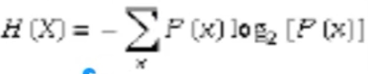
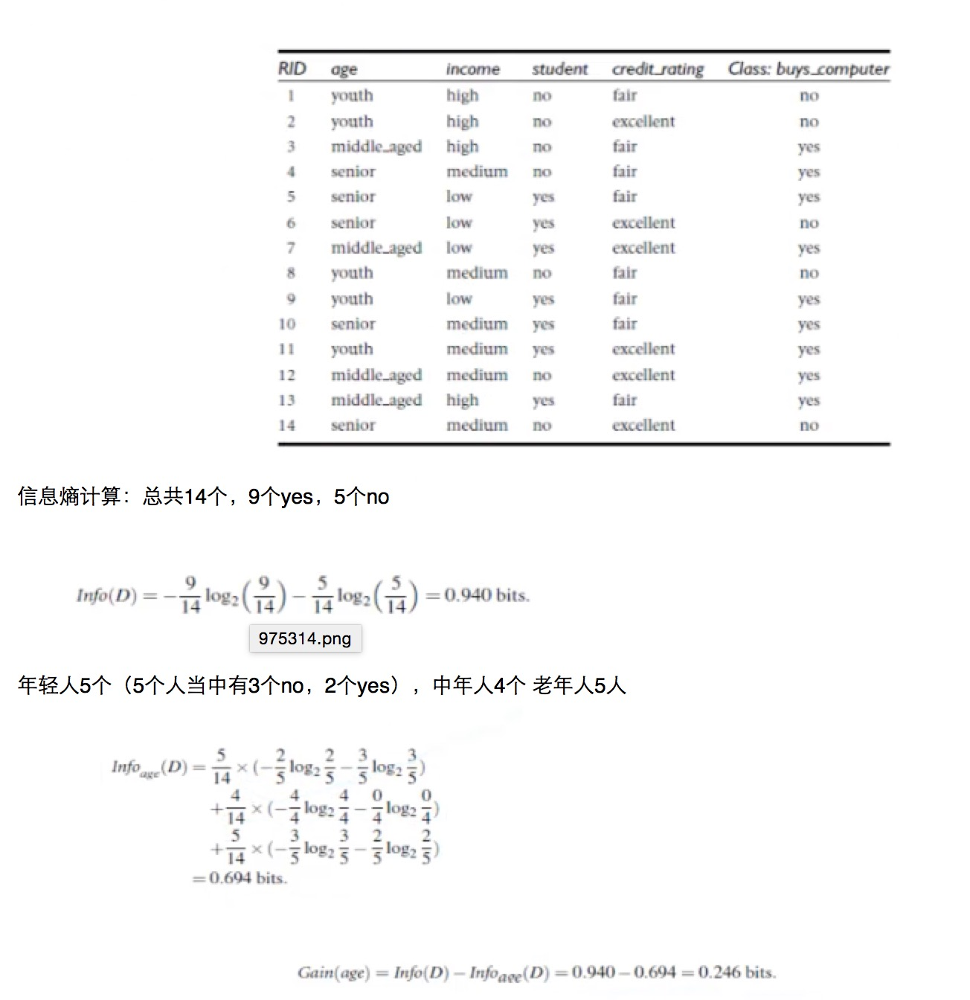

# python使用决策树算法

步骤：

1. 导入数据
	
	***利用csv导入数据***
2. 分离数据

	***将输入数据，和结果数据分离出来***
	
3. 转化数据

	***将输入数据和结果数据转化成0，1格式的数据(sklearn处理此类型数据)***
	
	举例：
	
| rid | age |	income |	student | credit_rating | buys |
| --------- |:---------:| -----:|-----:|-----:|-----:|
| 1 | youth | high | no |	fair |	no |
| 2 | youth | high | no |	excellent | no |
| 3 |	middle_aged | high | no | fair | yes |
| 4 |	senior |	medium |	no | fair | yes |
| 5 |senior |	low | yes | fair | yes |
| 6 |	senior | low | yes | excellent |	no |
| 7 |	middle_aged |	low |	yes	 | excellent | yes |
| 8 | youth |	 medium | no | fair | no |
| 9 | youth |	low	 | yes |	fair | yes |
| 10 |	senior |	medium | yes | fair | yes |
| 11 |	youth |	medium | 	yes |	excellent | yes |
| 12 |	middle_aged |	medium | 	no	| excellent | yes |
| 13 |	middle_aged |	high | yes |	fair |	yes |
| 14 |	senior |	medium |	no |	excellent | no |


例如将第一行数据转换成

| youth |	middle_aged |	 senior |	high |	medium | low | yes | no |fail |	excellent | buy(结果) |
| --- |:--:| ---:|---:|---:|---:|---:|---:|---:|---:|---:|
| 1 | 0 | 0 | 1 | 0	| 0	 | 0 | 1 | 1 | 0 | 0 |	  


	
	
	输入数据转化如下
	
	```python
	dummyX[[ 0.  0.  1.  0.  1.  1.  0.  0.  1.  0.]
		   [ 0.  0.  1.  1.  0.  1.  0.  0.  1.  0.]
 		   [ 1.  0.  0.  0.  1.  1.  0.  0.  1.  0.]
   		   [ 0.  1.  0.  0.  1.  0.  0.  1.  1.  0.]
 		   [ 0.  1.  0.  0.  1.  0.  1.  0.  0.  1.]
 		   [ 0.  1.  0.  1.  0.  0.  1.  0.  0.  1.]
 		   [ 1.  0.  0.  1.  0.  0.  1.  0.  0.  1.]
		   [ 0.  0.  1.  0.  1.  0.  0.  1.  1.  0.]
 		   [ 0.  0.  1.  0.  1.  0.  1.  0.  0.  1.]
 		   [ 0.  1.  0.  0.  1.  0.  0.  1.  0.  1.]
 		   [ 0.  0.  1.  1.  0.  0.  0.  1.  0.  1.]
 		   [ 1.  0.  0.  1.  0.  0.  0.  1.  1.  0.]
 		   [ 1.  0.  0.  0.  1.  1.  0.  0.  0.  1.]
 		   [ 0.  1.  0.  1.  0.  0.  0.  1.  1.  0.]]
 	其中每一列对应的数据是:
 	['age=middle_aged', 'age=senior', 'age=youth', 'credit_rating=excellent', 'credit_rating=fair', 'income =high', 'income =low', 'income =medium', 'student=no', 'student=yes']

	```
	
	输出数据转化如下
	
	```python
	dummY[[0]
 		  [0]
 		  [1]
 		  [1]
 		  [1]
 		  [0]
 		  [1]
 		  [0]
 		  [1]
 		  [1]
 		  [1]
 		  [1]
 		  [1]
		  [0]]
	其中每一行都是最终结果，此例是是否购买的结果
	```
	
4. 建模

	```python
	 clf = tree.DecisionTreeClassifier(criterion='entropy') #声明使用决策树ID3算法
 clf = clf.fit(dummyX,dummyY);
	```
5. 生成dot文件
   
   ```python
   with open("allEletronicInformationGainOri.dot", 'w') as f:
    f = tree.export_graphviz(clf,feature_names=vec.get_feature_names(),out_file=f)
   ```
6. 利用graphviz工具将dot文件导入把决策树画出来（其中分支节点的上下关系根据<b>信息熵</b>的大小来评估的）

7. 测试和使用

	```python
#newRowX是0，1输入数据
predictedY = clf.predict(newRowX)
print("新数据结果" + str(predictedY))
	```
###信息熵的算法：(变量的不确定性越大，熵越大)  =负的 每一个发生的概率 乘以 以2为低概率的对数###






信息获取量(information Gain)： Gain(A) = info（D）-Info_A(D)
<br>
<br>
Gain(age) = 整体信息熵-年龄信息熵 = 以年龄的信息量
<br>
<br>
Gain哪个大，就选择哪个作为第一个节点，依次类推;  下一轮，以选择的下一组数据重新计算信息量，作为节点，例如一个节点以年龄，年轻人中数据第二个节点，要用年轻人的数据重新计算

<br>


## 总结
### 树剪枝叶（避免overfitting即深度太深，训练集表现良好，但正常使用表现不好）
- 先剪枝
- 后剪枝

###决策树优点
- 直观，便于理解，小规模数据集有效

###决策树缺点
- 处理连续变量不好
- 类别较多时，错误增加的比较快
- 可规模性一般

[代码地址](https://github.com/CentMeng/deeplearning/blob/master/net/msj/decisiontree/DecisitonTree.py)
 
