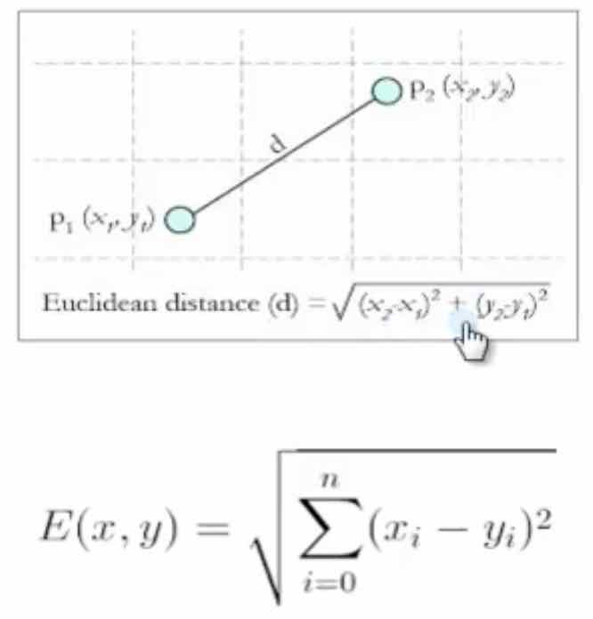
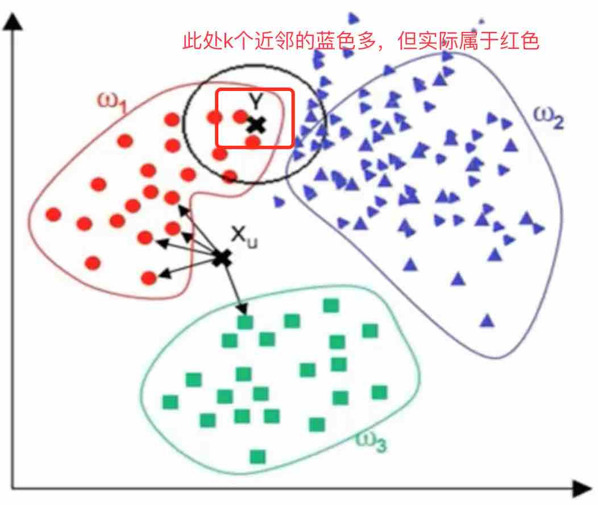

# 最邻近规则分类（K-Nearest Neighbor）KNN算法

## 综述

- Cover和Hart在1968年提出了最初的邻近算法

- 分类算法

- 输入基于实例的学习（instance-based learning），懒惰学习（lazy learning）

## 算法详述
  
### 步骤
  
  1. 为了判断未知实例的类别，以所有已知类别的实例作为参照
  2. 选择参数k
  3. 计算未知实例与所有已知实例的距离
  4. 选择最近K个已知实例（奇数个）
  5. 根据少数服从多数的投票法则，让未知实例归类为K个最邻近样本中最多数的类别
  
### 细节
 - 关于K：关于距离的衡量方法
  



 - 其他距离衡量：余弦值（cos），相关度（correlation），曼哈顿距离（Manhattan distance）【美国曼哈顿金融中心，都是正南正北，横七竖八的，两个点的距离不是直线距离，需要计算走几个街区，比如正东走两个街区，正北走三个街区】

 - 分别算出G点到各个点的距离，例如G到F，G到E，依次类推，找到最近的几个

## 算法优缺点
### 算法优点

- 简单
- 易于理解
- 容易实现
- 可以对K的选择可具备丢噪音数据的健壮性

### 算法缺点

- 需要大量的空间存储已有实例
- 算法复杂度（需要比较所有已知实例与要分类的实例）
- 当其样本分布不平衡时，比如其中一类样本过大（实例数量过多）占主导的时候，新的未知实例容易被归类为这个主导样本，因为这类样本实例的数量过大，但这个新的未知实例实际并不接近目标样本

### 改进版本
- 考虑距离，增加距离权重
   
  比如：1/d (d: 距离)

