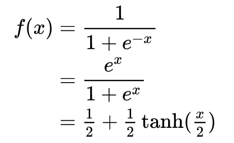

# 非线性转化方程(non-linear transformation function)

> sigmoid函数(S 曲线)用来作为activation function

## 1.双曲函数(tanh)

> tanh是双曲函数中的一个，tanh()为双曲正切。在数学中，双曲正切“tanh”是由基本双曲函数双曲正弦和双曲余弦推导而来

- 公式

- 定义:双曲正切函数是双曲函数中的一个函数。

- 定义域和值域
  - 函数：y=tanh x
  - 定义域：R，值域：(-1,1)
  - y=tanh x是一个奇函数，其函数图像为过原点并且穿越Ⅰ、Ⅲ象限的严格单调递增曲线，其图像被限制在两水平渐近线y=1和y=-1之间。

- 周期性:双曲正切函数y=tanhx，其不是周期函数

- 导数
  - 双曲正切函数的导数公式：f(x)'=1-f(x)*f(x)

## 逻辑函数(logistic function)
- Logistic函数或Logistic曲线是一种常见的S形函数，它是皮埃尔·弗朗索瓦·韦吕勒在1844或1845年在研究它与人口增长的关系时命名的。广义Logistic曲线可以模仿一些情况人口增长（P）的S形曲线。起初阶段大致是指数增长；
然后随着开始变得饱和，增加变慢；最后，达到成熟时增加停止。

- 公式：

- 求导：

> { {{d}/{dx}}f(x)=f(x)(1-f(x))} 

## 双曲函数图

