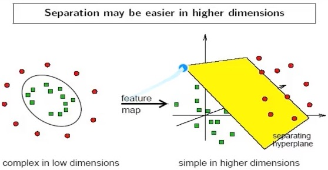

# 支持向量机（Support Vector Machine）SVM算法

## 背景

- 深度学习（2012）出现之前，SVM被认为机器学习中近十几年来最成功，表现最好的算法

## 机器学习一般框架

- 训练集 -> 提取特征向量 -> 结合一定算法（分类器：决策树、KNN）-> 得到结果 
  
## SVM图解


SVM就是找到哪条线更适合---SVM寻找区分两类的超平面(hyper plane)，是边际（margin）最大


1. Q:总共可以有多少个可能的超平面？

	A:无数条

2. Q：如何选取边际（margin）最大的超平面(Max Margin Hyperplane)?

	A:超平面到一侧最近点的距离等于到另一侧最近点的距离两侧的两个超平面平行


## 线性可区分（linear separable） 和 线性不可区分(linear inseparable)


- 以上两种都是线性不可区分，就是不能通过线来彻底分开来

## 定义与公式

- 超平面可以定义为：

```
W * X + b = 0
W:权重向量  weight vector, W = {W1,W2,………Wn}  n是特征值的个数
X：训练实例
b: 偏向（bias）
```

- 举例：


假设2位特征向量：X = （x1，x2）

把b想象为额外的weight

超平面方程变为：
		w<sub>0</sub>+w<sub>1</sub>x<sub>1</sub>+w<sub>2</sub>x<sub>2</sub> = 0

所有超平面右上方的点满足：
    	w<sub>0</sub>+w<sub>1</sub>x<sub>1</sub>+w<sub>2</sub>x<sub>2</sub> > 0

 所有超平面右上方的点满足：
    	w<sub>0</sub>+w<sub>1</sub>x<sub>1</sub>+w<sub>2</sub>x<sub>2</sub> < 0

调整weight，使超平面定义边际的两边：
		
H<sub>1</sub> : w<sub>0</sub>+w<sub>1</sub>x<sub>1</sub>+w<sub>2</sub>x<sub>2</sub> > = 1 for y<sub>i</sub> = +1 （+1是分  类名）

H<sub>2</sub> : w<sub>0</sub>+w<sub>1</sub>x<sub>1</sub>+w<sub>2</sub>x<sub>2</sub> < = 1 for y<sub>i</sub> = -1  （-1是分类名）


综合以上两式，得到：（1）


- 所有坐落在边际的两边的超平面上的被称作“支持向量”（就是在边际上的点）
- 分界的超平面和H1或H2上任意一点的距离为

```
1 / ||W|| (||W||是向量的范数(norm),读W norm)
```
  
### ||W|| 算法


所以，最大边际距离为：

```
2 / ||w|| 
```

## 求解

### SVM如何找出最大边际的超平面(MMH)？

利用一些数学推到，公式（1）可变为有限制的凸优化问题（convex quadratic ）利用Krush-Kuhn-Tucker（KKT）条件和拉格朗日公式，可以推出MMH可以被表示为以下“决定边界（decision boundary）”


y<sub>i</sub>是支持向量点

X<sub>i</sub>是类别标记（支持向量的标记）

X<sup>T</sup>是要测试的实例（转置矩阵）

𝜶<sub>i</sub> 和b<sub>0</sub> 都是单一数值型参数，由以上提到的最优算法提出（𝜶<sub>i</sub>是拉格朗日的一个乘
数 ）

l是支持向量点的个数

### 对于任何测试（要归类的）实例，带入以上公式，得出的符号是正还是负决定

## 示例


***此处w<sub>0</sub>就是b<sub>0</sub>***

> 训练好的模型的算法复杂度是由支持向量的个数决定的，而不是由数据的维度决定的。所以SVM不太容易产生overfitting

> SVM训练出来的模型完全依赖于支持向量，即使训练集里面所有非支持向量的点都被去除，重复训练过程，结果仍然会得到完全一样的模型

> 一个SVM如果训练得出的支持向量个数比较小，SVM训练出的模型比较容易被泛化

## 线性不可分情况

- 解决方式：
  1. 利用一个非线性的映射把原数据集中的向量转化到一个更高维的空间中 
  2. 在这个高维度的空间中找一个线性的超平面来根据线性可分的情况处理




- 示例：利用非线性映射把原始数据转化到高维中

```
3维输入向量：x=（x1,x2,x3）
		转化到6维空间Z中去：
```


```
 新的决策超平面：
			d(Z) = WZ + b
 其中W和Z是向量，这个超平面是线性的
		解出W和b之后，并且带入回原方程：
```


## 关键问题

- 如何选择合理的非线性转化把数据转到高纬度中？
- 如何解决计算内积时算法复杂度非常高的问题？

> 内积：两个向量a = [a1, a2,…, an]和b = [b1, b2,…, bn]的点积定义为：a·b=a1b1+a2b2+……+anbn。

- 解决方法：核方法（kernel trick）

1. 动机：在线性SVM中转化为最优化问题时求解的公式计算都是以内积（dot product）的形式出现的
φ(x<sub>i</sub>) -  φ(x<sub>j</sub>)
其中，φ(x)是把训练集中的向量点转化到高维的非线性的映射函数，因为内积的算法复杂度非常大，所以我们利用核函数来取代计算非线性映射函数的内积 

2. 以下核函数和非线性映射函数的内积等同
  
      K（x<sub>i</sub>，x<sub>j</sub>）= φ(x<sub>i</sub>) -  φ(x<sub>jj</sub>)

3. 常用的核函数
	- h度多项式核函数（polynomial kernel of degree h）：
	
	K(X<sub>i</sub>,X<sub>j</sub>) = (X<sub>i</sub>X<sub>j</sub>+1)<sup>h</sup>
	
	- 高斯径向基核函数（Gaussian radial basis function kernel）：
	
	K(X<sub>i</sub>,X<sub>j</sub>) = e<sup>-||X<sub>i</sub>-X<sub>j</sub>||</sup>/2𝜶<sup>2</sup>
	
	-  S型核函数（Sigmoid function kernel）：

		K(X<sub>i</sub>,X<sub>j</sub>) = tanh(𝜶X<sub>i</sub>X<sub>j</sub>-δ)
		
> 如何选择使用哪个kernel？
> 
> 根据先验知识，比如图像分类，通常使用RBF（高斯径向基核函数），文字不使用RBF
尝试不同的kernel，根据结果准确度而定
	
### 核函数示例


同样的结果，使用kernel方法计算容易很多

> SVM怎样可解决多个类别分类的问题?
> 
> 对于每个类，有一个当前类和其他类的二类分类器（one-vs-rest）

